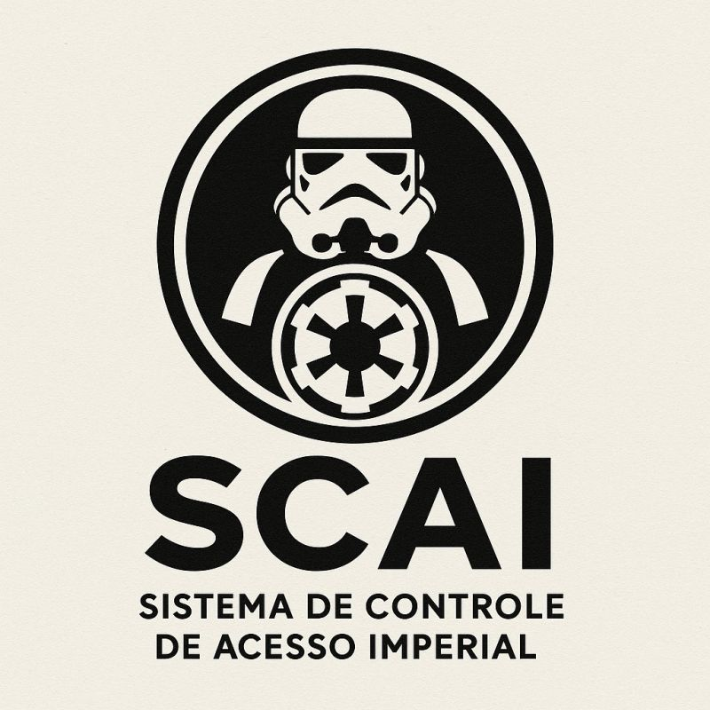

<h1 align="center">SCAI - Imperial Access Control System</h1>

<div align="center">
  
</div>

<div align="center">

[](https://dotnet.microsoft.com/)
[](https://github.com/seuusuario/SCAI.API/actions)
[](LICENSE.txt)
[](https://starwars.fandom.com/wiki/Galactic_Empire)

</div>

<p align="center">
  <a href="#-about">About</a> •
  <a href="#-architecture">Architecture</a> •
  <a href="#-stack">Stack</a> •
  <a href="#-security-and-rbac">Security</a> •
  <a href="#-installation">Installation</a> •
  <a href="#-tests">Tests</a>
</p>

<div align="center">
  <strong>[<a href="README.pt-BR.md">Versão em Português</a>]</strong>
</div>

---

## 🌌 About

**SCAI (Imperial Access Control System)** is an inventory and supply chain management system developed for the Galactic Empire from the Star Wars saga.

Built as a **REST API** using **.NET 10**, the project simulates a real corporate scenario, demonstrating:
* Modern, decoupled architecture patterns.
* Authentication and authorization.
* Role-Based Access Control (RBAC).
* CRUD with Entity Framework Core.

> *The main goal is to serve as a reference for enterprise-level .NET applications, using the Star Wars theme to make learning more interesting and engaging.*

---

## 🏗️ Architecture

The solution adopts a **Three-Layer Architecture**, promoting separation of concerns and facilitating unit testing.

### Layer Details

| Layer | Component | Responsibility |
| :--- | :--- | :--- |
| **1. Presentation** | `Controllers` | API entry point. Manages HTTP requests, DTO validation, and standard response formatting (Envelope Pattern). |
| **2. Business (Domain)** | `Services` | The heart of the application. Contains business logic, Empire rule validations, and access policy checks. |
| **3. Data Access** | `Repositories` | Database abstraction using **EF Core**. Manages transactions and optimized SQL queries. |

---

## 🛠️ Stack

This project is at the forefront of the .NET ecosystem, using modern and high-performance features.

| Category | Technology | Details |
| :--- | :--- | :--- |
| **Core** | **.NET 10** | C# 14, ASP.NET Core Web API |
| **Data** | **SQL Server** | Entity Framework Core 10.0 |
| **Auth** | **JWT Bearer** | Digitally signed tokens, BCrypt.Net-Next |
| **Docs** | **OpenAPI** | Swagger UI / Swashbuckle |
| **Tests** | **xUnit** | Moq for dependency mocking |

---

## 🔐 Security and RBAC

Security is the pillar of the Empire. The system uses **Role-Based Access Control (RBAC)**.

### Permission Hierarchy

| Role | Level | Permissions |
| :--- | :---: | :--- |
| 🔴 **Sith** | 1 (Admin) | **Full control**. Can perform all CRUD operations and access items with permission 1. |
| 🟡 **Commander** | 2 (Manager)| **Write**. Can update items and access items with permission 2. |
| ⚪ **Trooper** | 3 (Read) | **Read only**. Can view the list of items with permission 3. |

### Authentication Flow

1.  **Register**: Endpoint `/api/auth/register`. Passwords are hashed with **BCrypt**.
2.  **Login**: Endpoint `/api/auth/login`. Returns a **JWT (JSON Web Token)**.
3.  **Access**: The client must send the header: `Authorization: Bearer <jwt_token>`.

---

## ⚙️ Installation and configuration

### Prerequisites

* [.NET 10 SDK](https://dotnet.microsoft.com/download)
* SQL Server (Local, Docker, or Azure)
* IDE: Visual Studio 2022+, VS Code, or Rider

### 1. Clone the repository

```bash
git clone https://github.com/frodrigss/SCAI.API.git
cd SCAI.API
```

### 2. Environment configuration
For your security, avoid committing sensitive credentials. Create a `.env` file in the `SCAI` directory or use .NET User Secrets.

Example `.env`:

```env
# Database
ConnectionStrings__DbConnection="Server=localhost;Database=SCAI_DB;Trusted_Connection=True;MultipleActiveResultSets=true"

# Security
Jwt__Key="YOUR_JWT_KEY"
Jwt__Issuer="SCAI.API"
Jwt__Audience="SCAI.Client"
```

### 3. Run migrations and seed the database
Run the migrations to create the database structure and seed it with data from `SeedData.cs` located in `SCAI/Infrastructure/Data`.

```bash
cd SCAI
dotnet ef database update
```

### 4. Run

```bash
dotnet run
# Access via http://localhost:5000 or check the port in the console
```

---

## 🧪 Tests

System integrity is ensured by an automated test suite located in the `SCAI.Tests` project.

Run the tests with the command:

```bash
cd SCAI.Tests
dotnet test
```

### Coverage

| Layer | Coverage | Status |
| :--- | :---: | :--- |
| Controllers | 78% |  |
| Services | 86% |  |
| Repositories | N/A |  |
| Models | 89% |  |

---

## 📂 Folder structure

```
SCAI.API/
├── Images/                         # Images for documentation
├── SCAI/                           # Main Web API project
│   ├── Controllers/                # API endpoints
│   ├── Infrastructure/             # Cross-cutting concerns (Data, Auth)
│   │   ├── Data/                   # DbContext and Migrations
│   │   └── Interfaces/             # Infrastructure interfaces
│   ├── Migrations/                 # EF Core migrations
│   ├── Models/                     # Domain entities and DTOs
│   ├── Properties/                 # Project properties
│   ├── Repositories/               # Data access logic
│   ├── Services/                   # Business logic
│   ├── appsettings.json            # Configuration
│   └── Program.cs                  # Entry point & DI configuration
├── SCAI.Tests/                     # Unit test project
├── .gitignore                      # Git ignore file
├── LICENSE.txt                     # MIT License
├── README.md                       # Documentation
├── README.pt-BR.md                 # Portuguese documentation
└── SCAI.API.sln                    # Visual Studio solution
```

## 📄 License

This project is licensed under the MIT License. See the [LICENSE](LICENSE.txt) file for details.
